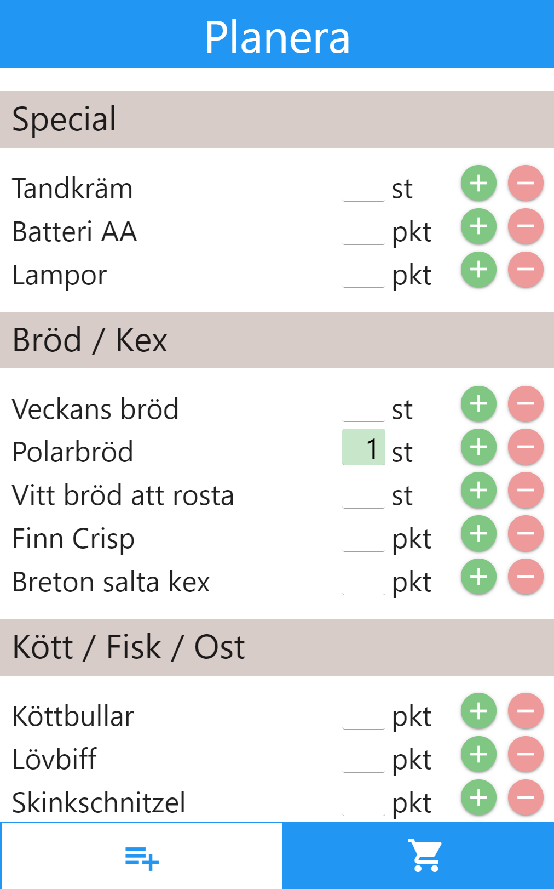
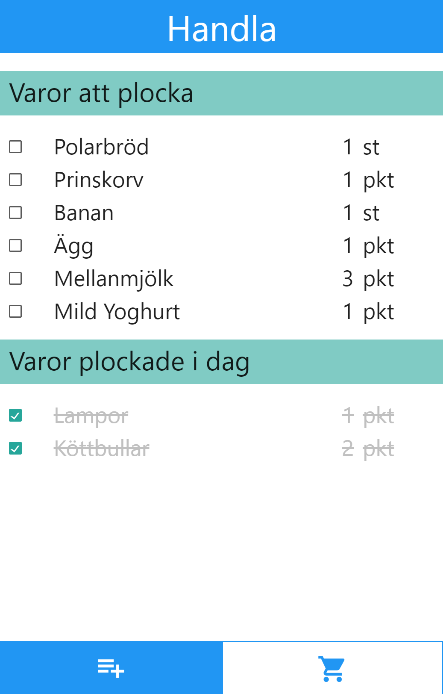

# BlazorShopping
Simple demo application using Blazor.

## Use cases
A simple app that will help out in the weekly food shopping. The background is my own family where we are five people eating a lot. It is hard to keep track of what should be shopped and when. If we use the same app to keep track of what needs to be bought in the weekly shopping, it will hopefully be easier. But I have yet to persuade my wife to actually use the app :)
- In the planning section you can pick items to buy on your next shopping
- In the shopping section you tick every item as you pick them in the shop
- Items picked before today will disappear from scope

Planning | Shopping
------------ | -------------
 | 

## Two hosting models
The same application is included in *two* versions targeting the two Blazor hosting models: Server and WebAssembly. The code is almost identical which means you can choose model depending on your use case.

The **Server** model will have all code executing on server and will only download minimal prerendered simple pages with javascript hooks for server communication. All communication with server will be through SignalR. This will provide speed, minimal size and low latency.

The **WebAssembly** model will generate a SPA client with webassembly code. It will be fast and responsive but demand a bigger initial download. Server communication will be done with normal API communication but still greatly simplified since server and client will use the same models, thus avoiding all mapping complexity.

## Deploy
1. Create an `appsettings.Development.json` file in the application root of each solution.
1. In it you override the `ApplicationDbContext` setting with a connection string to an existing empty SQL Server Database.
1. Ensure `ApplyDatabaseMigrations` is executed in the `Startup` `Configure` method.
1. When you launch the application the database schema will automatically be generated and some demo data will be added.

## Demo
The BlazorShoppingServer solution will hold some demo example pages. To execute them you just add the page name after the baseurl (/demo1, etc) in your browser.

## Content covered in demo
- HTML template
- Shared base templates
- Static files in wwwroot
- Pages
- Code behind
- CSS isolation
- Page life cycle
- Components
- Parameters
- Model binding
- Event binding

## Presentation slides
The full presentation slides are also included for reference.